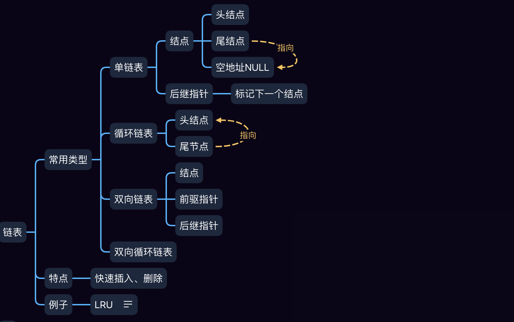





<!-- more -->



## 概念



链表不需要连续的内存，通过指针将零散的内存块关联起来。

#### 数组与链表的比较

最直观的比较是数组是连续的内存块，而链表不需要连续。

性能比较：



## 常见分类



常见的链表有单链表，双向链表，循环链表，双向循环链表等。

#### 单链表

顾名思义，单链表是单方向的，链表由`数据结点`和`后继指针`组成。

**特点**

#### 循环链表

#### 双向链表

#### 双向循环链表



## 特性





## 编码





## 样例



此处使用`scala`实现常见的链表样例。

### LRU

### 回文